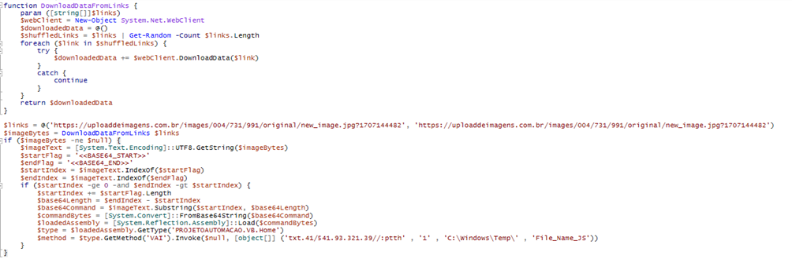

# Agent Tesla - Malware Analysis Report

Deda.Cloud Cyber Security Team • 28 Mar 2024

*Cybersecurity BlueTeam, Deda.Cloud*

# **Introduction**
Agent Tesla is a .Net-based Remote Access Trojan (RAT) and data stealer for gaining initial access that is often used for Malware-As-A-Service (MaaS). In this criminal business model, threat actors known as initial access brokers (IAB) outsource their specialized skills for exploiting corporate networks to affiliate criminal groups. As first-stage malware, Agent Tesla provides remote access to a compromised system that is then used to download more sophisticated second-stage tools, including ransomware. 

🌐 [AGICOM: AgentTesla intensifica la sua presenza in Italia: il ruolo cruciale degli allegati PDF](https://cert-agid.gov.it/news/agenttesla-intensifica-la-sua-presenza-in-italia-il-ruolo-cruciale-degli-allegati-pdf/)

# **Key points**

# **1st stage**

# **2nd stage**

# **3rd stage**

# **4th stage**

# **5th stage**
