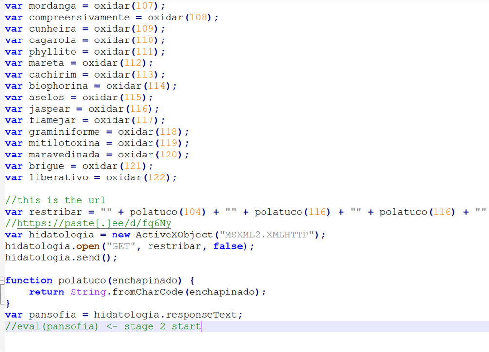
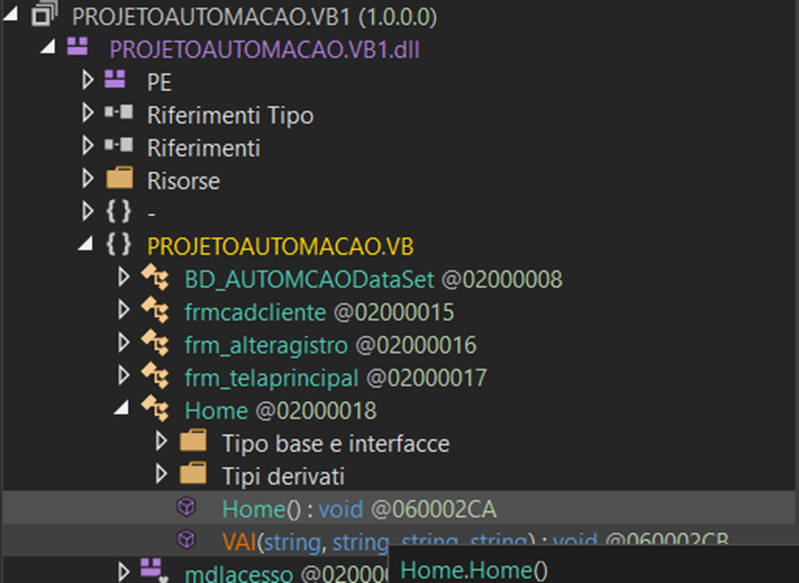

# Agent Tesla - Malware Analysis Report

Deda.Cloud Cyber Security Team • 28 Mar 2024

*Cybersecurity BlueTeam, Deda.Cloud*

# **Introduction**
Agent Tesla is a .Net-based Remote Access Trojan (RAT) and data stealer for gaining initial access that is often used for Malware-As-A-Service (MaaS). In this criminal business model, threat actors known as initial access brokers (IAB) outsource their specialized skills for exploiting corporate networks to affiliate criminal groups. As first-stage malware, Agent Tesla provides remote access to a compromised system that is then used to download more sophisticated second-stage tools, including ransomware. 

🌐 [AGICOM: AgentTesla intensifica la sua presenza in Italia: il ruolo cruciale degli allegati PDF](https://cert-agid.gov.it/news/agenttesla-intensifica-la-sua-presenza-in-italia-il-ruolo-cruciale-degli-allegati-pdf/)

# **Key points**

In this document, we will take a deep dive into steps the malware takes to execute the payload through these layers, as well as the various techniques it employs to hinder and slow down the analysis process.

Some of these significant features include:

- Use of AES256 encryption in javascript using "RijindaelManaged" .NET encryption module
- Use of images to hide base64 encoded .NET PEs
- Use of **fileless loader** in the infection chain helps the IoC's threat to be undiscovered.
- **Process Hollowing** has been implemented in the final stages of the loader, wherein the code of RegAsm.exe is replaced with the payload associated with Tesla.

# **1st stage**
The initial javascript payload is started from a document. In this specific case, an excel document created a wscript process executing the following javascript code:

In this case, an URL is istantiated in the variable "restribar" to retrieve more javascript code, to be executed in memory using the "eval" function. The downloaded script will perform the decryption of an hardcoded encrypted value, which would be a Powershell script.

# **2nd stage**

The payload is encoded in base64 and obfuscated thanks to RijindaelManaged, a .NET cryptography module. All the configuration for the cryptor, along with the key, is stored in the code.

After the decryption process, the Powershell script is executed through Wscript.exe

# **3rd stage**

The purpose of the Powershell script is to download an image, find the placeholders <BASE64_START> and <BASE64_END>, and decode the base64 value embedded in the images. This would be a valid .NET DLL, which would be loaded in-memory thanks to Powershell Reflection

The method loaded and executed from the DLL receives four arguments, which will be used to perform operations later.

# **4th stage**
The second argument is a numeric value used as a flag, in this case to decide wether to install a persistence. Then, data is downloaded from the valid url obtained by reversing the first argument. This data is a reversed base64, and if decoded, it can be confirmed that it is a valid .NET PE file. The routine Tools.Ande performs a process hollowing operation, by creating the suspended process *C:\\Windows\\Microsoft.NET\\Framework\\v4.0.30319\\RegAsm.exe*
 
The start routine receives the third and fourth arguments, a path and a filename. All the javascript files in the run-directory of the executable are copied in the *HKEY_LOCAL_MACHINE\Software\Microsoft\Windows\CurrentVersion\Run*

The process hollowing is performed in a classic way

# **5th stage**
The main features include browser password stealing, keylogging, screenshots near the cursor, and many other application credential stealing, as well as extensive enumerating of the system resources and available devices.

